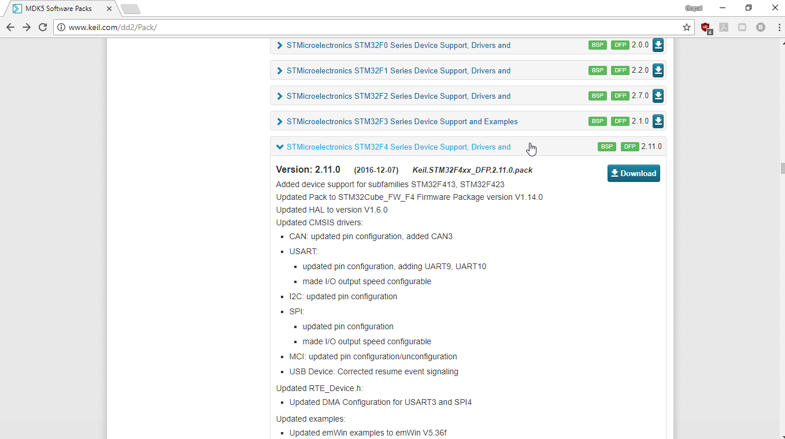
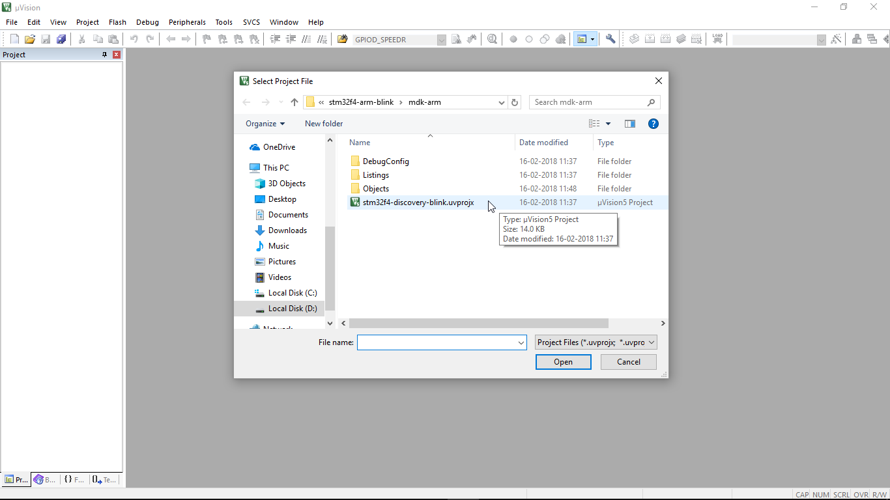
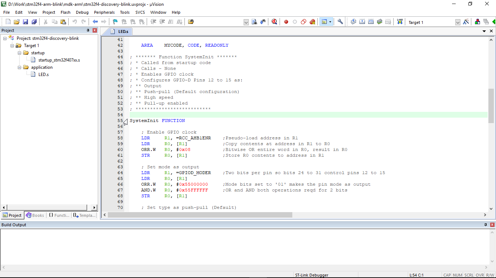
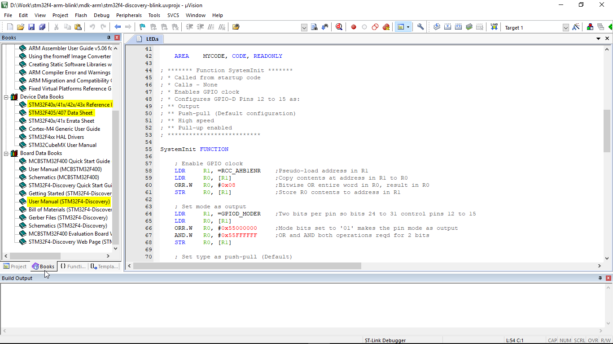
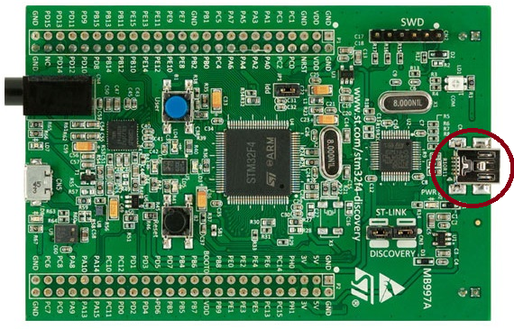
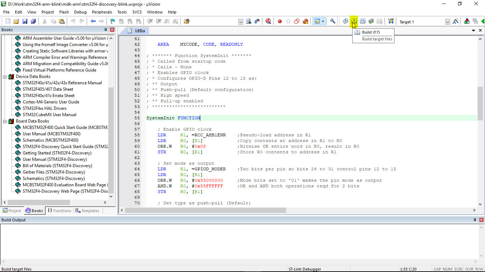
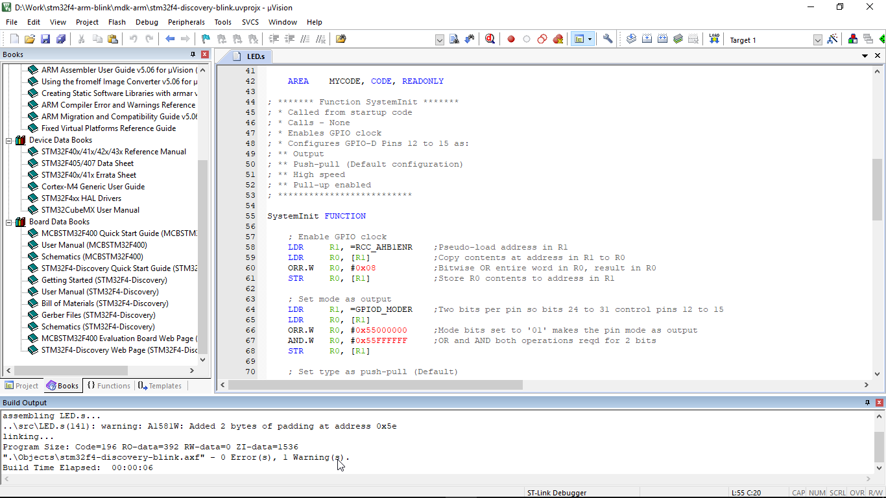
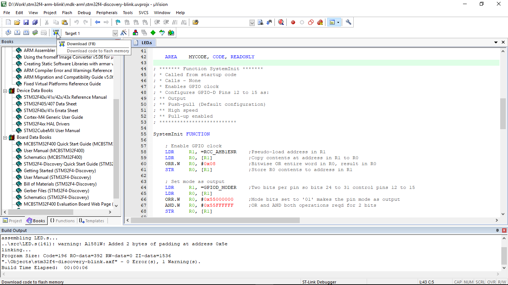
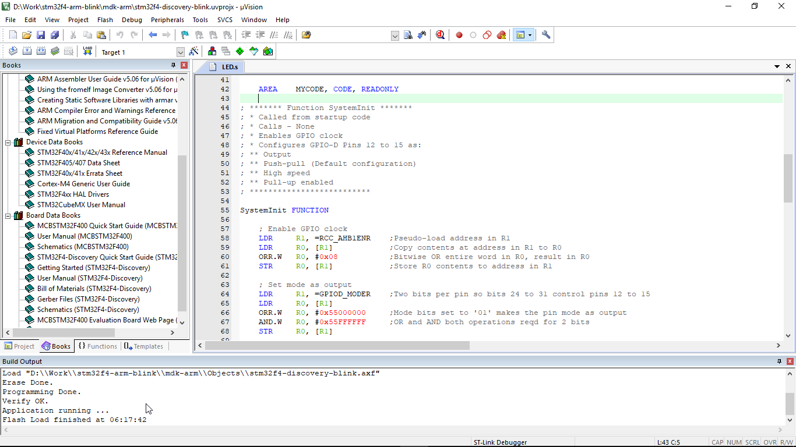

### Blink LEDs with ARM assembly on STM32F4
This repository contains code written in ARM (V7-M) assembly to blink LEDs on the STM32F4 discovery board.

For detailed explanation of the code, refer blog post - [https://iotality.com/stm32f4-blink](https://iotality.com/stm32f4-blink)

This code uses ARM assembler and not the GNU assembler. Source code is contained in this repository in the [src](/src). The project files (for Keil uVision IDE) are in the [mdk-arm](/mdk-arm) folder.

This README contains instructions to build and download the code to STM32F4 discovery board.

##### Prerequisites

* Get hold of a [STM32F4 Discovery board](www.st.com/en/evaluation-tools/stm32f4discovery.html)  so you can see the LEDs blinking. In absence of the board you can also use the Keil simulator and watch the registers but that part is not covered here.

* Download and install Keil MDK Lite Edition from Keil website - [keil.com/demo/eval/arm.htm#DOWNLOAD](keil.com/demo/eval/arm.htm#DOWNLOAD)

* Install software packs from Keil
 After installation of the IDE, you need to install the software packs for ST Micro devices.

 * Head to [http://www.keil.com/dd2/Pack/](http://www.keil.com/dd2/Pack/) and locate the ST Microelectronics STM32F4 Series Device Support Drivers and Examples. Click on the 'Download' button which will download an installation file with the extension '.pack'.

 

  * Double click on the downloaded file and follow on screen instructions to install the STM32F4 software pack within Keil.

#### Steps

Follow the steps below to open the project and see yourself the LEDs blinking on STM32F4 Discovery board.

##### Step 1

Launch Keil uVision IDE. From the 'Project' menu click on 'Open Project' and select the project file  [mdk-arm/stm32f4-discovery-blink.uvprojx](mdk-arm/stm32f4-discovery-blink.uvprojx)

##### Step 2

The 'Books' tab shows useful documents and resources. In particular the STM32F40x Reference manual, STM32F407 Datasheet and STM32F4-Discovery user manual come handy to understand and write assembly code.

##### Step 3

Connect the STM32F4 Discovery board to your PC. Make sure you connect the USB cable to the ST-Link debugger (circled in the below image).

##### Step 4

Build the project. From the 'Project' menu click on 'Build' or use hotkey 'F7' or click on the Build button in toolbar as shown below.

You should see the build messages with no errors in the 'Build Output' window. For now you can ignore the warning appearing about padding.

##### Step 5
Download code to the board. From the 'Flash' menu click on 'Download' button or use hotkey 'F8' or click on the Download button in the toolbar as shown below.

You should see messages with no errors in the Build Output window again.

Your board should be flashing all the 4 LEDs at 500msec interval.

##### Step 6

You are done. Head on to the blog post [https://iotality.com/stm32f4-blink](https://iotality.com/stm32f4-blink) to learn more about coding in ARM assembly.
